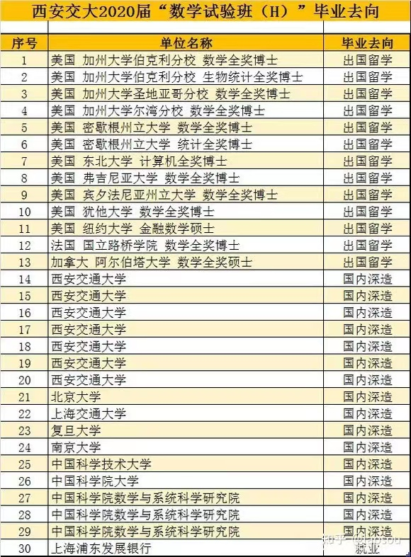
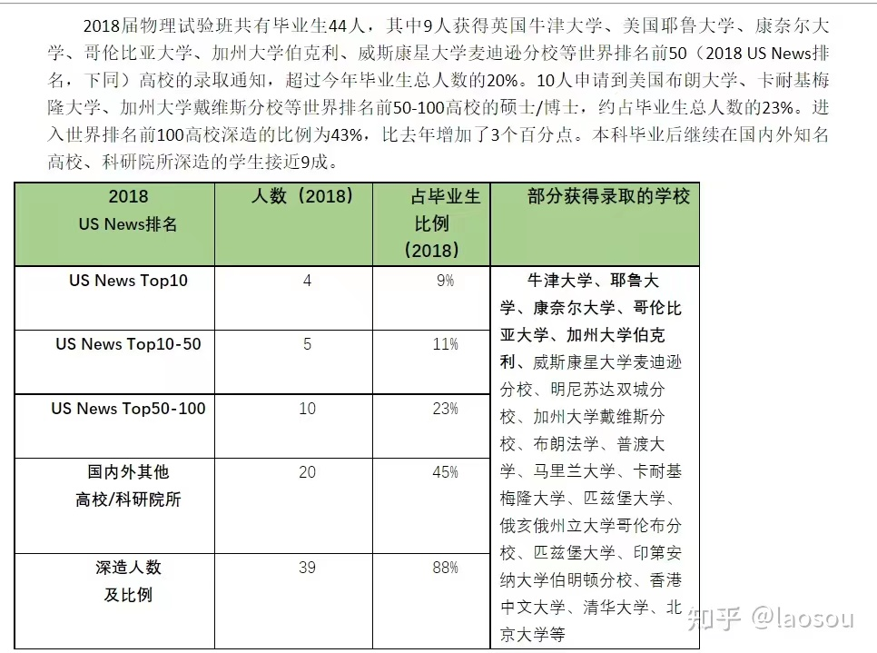
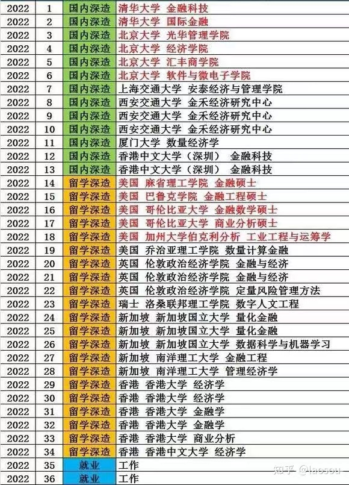

#关于西安交通大学：赢者通吃

&emsp;&emsp;笔者在西安交通大学共度过了七年，走了一些弯路，有了一些体悟，想把一些事情展示给读者们，所以想要写一些文章。

&emsp;&emsp;声明：以下文章，纯属笔者在西安交通大学期间的个人感悟，关于文章中的论据，能用数据表示的，笔者尽量用数据表示；不能用数据表示的，笔者就以主观想法、情感臆断来说明，需要说明的是，这些主观臆断很可能有错误，大家姑且看之。

&emsp;&emsp;笔者想先以本科生为出发，本科生能写完的话，笔者就写硕士生。博士实在没有相关的经历，就不敢妄言了。

&emsp;&emsp;首先，笔者必须说明的是，西安交通大学是一所赢者通吃的学校，头部的同学获取到的资源非常多，在此基础上能走的更远的多，比如以下的班级，光看这个毕业去向，你甚至觉得西安交通大学是当之无愧的Top9高校。

这个就业去向，个人认为是非常好的，绝对不亚于所谓的“华东五校”

&emsp;&emsp;如果说读者说数学是西安交通大学的强势专业，那么物理学作为学科评估排名B+的学校，其去向也非常优秀：

这个数据也很拿得出手，当然时间有点早了

    
2022年金禾实验班的就业去向，其中offer的分量学金融的同学应该一眼就明了，需要注意的是，金融一向不是西安交大的强项，很多人认为西安交通大学的金融不如武大中山厦大这些学校。

&emsp;&emsp;但是其他班呢？如果看到这里的读者是来自比较一般的班级，请读者自己想想，普通班的周围同学是什么样的呢？有几个人有这种丰富的眼界？有多少人能够申请到国外名校的全奖博士学位？有几个人会选择（或者有机会）保送到更高档次外校？

&emsp;&emsp;以笔者在西安交通大学期间的经历，可以毫不客气地说，普通班的学生和实验班的学生的去向简直是天壤之别，普通班或许电气能动这种强系出国能占个百分之十？一般系占个百分之五？笔者觉得这个估算都是往高里估了，而且出国的去处少有图中这么好的项目，很多还是靠自己家庭背景，自费出去交流获得的结果。而保送外校的就更少了，有些是能力不够对面不要，有的更是由于种种因素（这里不细说了，希望读者永远不用理解其中的深意），只能选择留在本校。

&emsp;&emsp;那么为什么不同班级去向迥异？不难看出，这些班级背后都有钱学森学院的影子，是普通班和钱学森学院之间的生源差距太大？也有可能，毕竟钱学森学院有很多少年班出来的学生，他们或许相比于高考进来的同学来说，是更好的苗子。但笔者更倾向认为，资源倾斜占了很大的因素。

&emsp;&emsp;笔者就以出国为例，据笔者了解，在笔者读本科的时候，西安交通大学的数学实验班、物理实验班的每个同学大三都有一次一学期出国交流的机会，这个机会是学院和学校出面给的，能报销绝大部分的花费，所以这些同学是xjtu中眼界最为广阔的那部分人，他们有机会出国去见识更广阔的世界，自然会对前途有更成熟的了解，而在毕业的时候，这些机会促成的推荐信倾斜、择校信息倾斜更是数不胜数。更加优厚的待遇是，这些同学只要不挂科，想保研每个人都有保研的机会，学院从根本上就解决了他们的后顾之忧，更别提各种进实验室的倾斜、大牛推荐信的倾斜，专门从外校引进教授西安交大不擅长的基础课等等等等，他们怎么能不走的更远？

&emsp;&emsp;而相比于普通班呢?即使是王牌专业，殊不知有多少学子在图书馆日复一日绞尽脑汁试图背诵PPT内容，指望着那点绩点获得保研名额，xjtu绝大多数普通专业保研率都在20%左右，笔者所在专业当年保研率甚至不超过20%（这里要加一句，现在西安交大的整体保研率绝对数值相比当年肯定有所提升，但是相对数值恐怕还是这个样子），在当年保研还有各种奇怪的操作，最后放弃保外的事情屡屡发生。读者如果是普通班的同学，不妨代入自己周围，看看周围是什么情况。

&emsp;&emsp;在笔者本科毕业的时候，西安交通大学的整体保研率应该就已经达到30%了，但是实际各个普通班的保研率远达不到这个水平。据笔者和同学交流的了解，在笔者毕业那年，上海交大电院的班级占到50%左右的同学就有保研机会（最后一名在哪里就不清楚了），而西安交通大学电信学院要占到前20%才有保研机会，笔者个人认为这是因为钱学森学院的班级占了很大一部分名额，而普通班选择出国和就业的人数太少，所有人都选择保研，所以内卷更加剧了这一情况，在这其中，氛围的影响也不言而喻，以笔者在硕士期间接触到的，留在西安交大的，本科来自实验班的同学的情况来看，实验班的同学通常视野开阔，做事灵活，好相处，由此笔者认为实验班的氛围绝对是好于普通班的，至于究竟好多少，笔者没有在实验班就读过，就不妄下评判了。

&emsp;&emsp;这里要说明一下，笔者对实验班没有任何针对的意思，毕竟实验班的同学是靠自己搜集信息、或者高考分数、或者少年班一路读上来获得这些机会的，笔者只是对这个现象做出了分析，在笔者看来，这批实验班就像是清末民国时期的中国一批批走向海外的留学生，在总体资源、总体氛围不足以产生特别知名的人的情况下，集全校之力，推出几个开眼看世界的领军人物，说不定之后就会出几个詹天佑、钱学森、邓稼先之类的领军人物；但是对普通班的同学来说，他们必须认识到，学校对他们的定位不会是领军人物；不会请外面的名教授教授你们知识；不会为你们特别争取交流机会；不会让你们每个人都有保研名额；不会特意让你们拥有开阔的眼界。这批同学必须清楚的认识到，按照学校的培养方案，一步一个脚印的走，加之以自己的努力，这些实验班的同学是能够成为领军人物的，而普通班的同学只能成为螺丝钉。

&emsp;&emsp;这里要说明的是，笔者当年知道的有类似资源的实验班只有数学实验班、物理实验班、钱学森实验班、金禾实验班，现在的钱学森书院相比于笔者当年肯定有了较大的改变，不过大家可以按照资源分配的方式对号入座一下，也就不难定位到现在的西安交大将那些班级的同学视作领军人物。身为普通班的同学，我们必须意识到，学校不会给我们提供太多资源，我们必须自己为自己负责，自己找到自己的定位，自己找到道路，自己成就自己，那么如何成就自己，我会在下篇文章中讲述。
